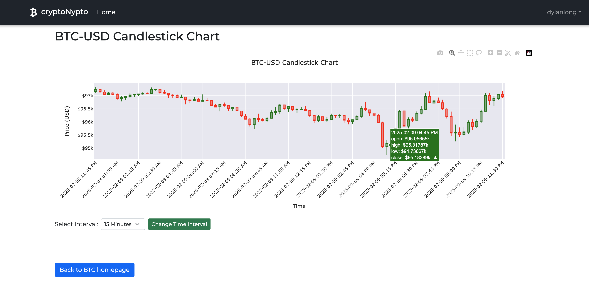

# Crypto-Nypto: A Full-Stack Django & Plotly Crypto Data Visualization App

Crypto-Nypto is a full-stack web application that allows users to fetch real-time cryptocurrency data, visualize trends using interactive Plotly charts, and securely manage their searches. The platform integrates with external crypto APIs, processes API requests efficiently, and stores user search history in a PostgreSQL database. The project is fully deployed on Heroku for live access.

* Fetch real-time cryptocurrency data from an external API
* Welcoming landing page built with bootstrap 5

     

  

    

* Secure authentication system with Django's built-in auth framework
* Store user search history in a PostgreSQL database
* Handle API requests & updates dynamically
* Implement automated testing for reliability and performance

    * Generate interactive Plotly charts for crypto trend analysis
     

  

    

## User Setup Guide: How to Install & Run Crypto-Nypto Locally

1. Open your terminal and run the following commands:
  - git clone https://github.com/dylanlongse/Crypto-Nypto.git
  - cd Crypto-Nypto

2. Create a virtual environment and activate it:
  * Run the following commands in the terminal (Windows):
    - python -m venv .venv
    - .venv\Scripts\Activate or venv\Scripts\activate

  * Run the following commands in the terminal (macOS/Linux)
    - python3 -m venv .venv
    - source .venv/bin/activate

3. Install Dependencies
  * Run the following commands in the terminal  
    - pip install -r requirements.txt

4. Set Up Environment Variables
  * Create a .env file in the project's root directory and add the following:
    - DEBUG=True
    - SECRET_KEY=your_secret_key_here
    - DATABASE_URL=sqlite:///db.sqlite3

  * Generate a secure Django Secret Key by running:
    - python -c "import secrets; print(secrets.token_urlsafe(50))"
    - replace your secret key value with what was returned from the previous command

5. Update crypto_nypto/settings.py
  * In this file, delete the following:
    - EMAIL_BACKEND = "django.core.mail.backends.smtp.EmailBackend"
    - EMAIL_HOST = "smtp.gmail.com"
    - EMAIL_PORT = 587
    - EMAIL_USE_TLS = True
    - EMAIL_HOST_USER = env.str("EMAIL_HOST_USER")
    - EMAIL_HOST_PASSWORD = env.str("EMAIL_HOST_PASSWORD")

  * Add this to replace everything above:
    - EMAIL_BACKEND = "django.core.mail.backends.smtp.EmailBackend"

6. Migrate the database and run server locally
  * Run the following in the terminal:
    - python manage.py migrate
    - python manage.py runserver

7. Access the Application
  * Once the server is running, open your browser and go to:
    - http://127.0.0.1:8000/

## License  
This project is open-source and licensed under the [MIT License](LICENSE).  
Feel free to fork, modify, and contribute!  

  
